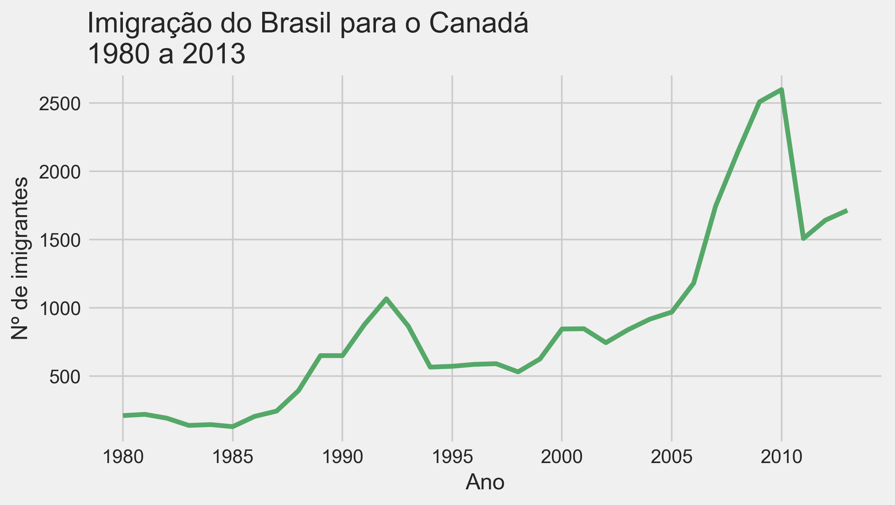
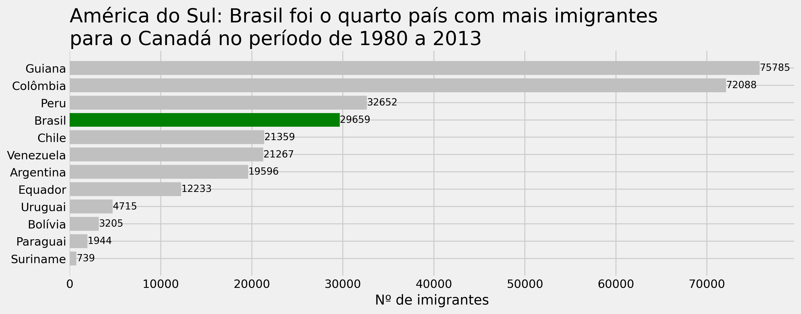
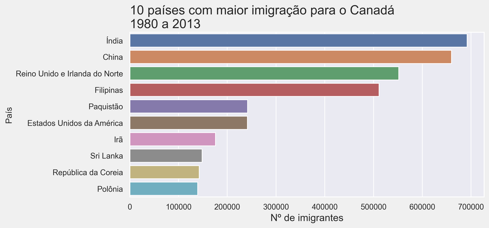

# Data Visualization

#### Bibliotecas utilizadas:
- Matplotlib
- Seaborn
- Plotly

## Alguns dos gráficos gerados:

<!DOCTYPE html>
<html lang="en">
<head>
    <meta charset="UTF-8">
    <meta name="viewport" content="width=device-width, initial-scale=1.0">
    <title>Gráfico Plotly</title>
</head>
<body>
    <iframe src="imigracao_america_sul.html" width="100%" height="600" frameborder="0"></iframe>
</body>
</html>

